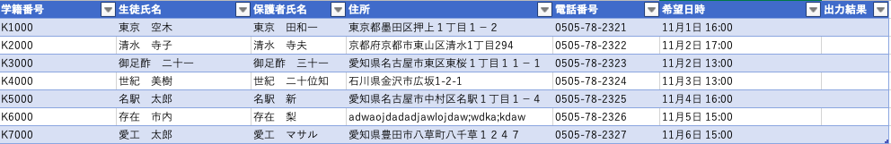
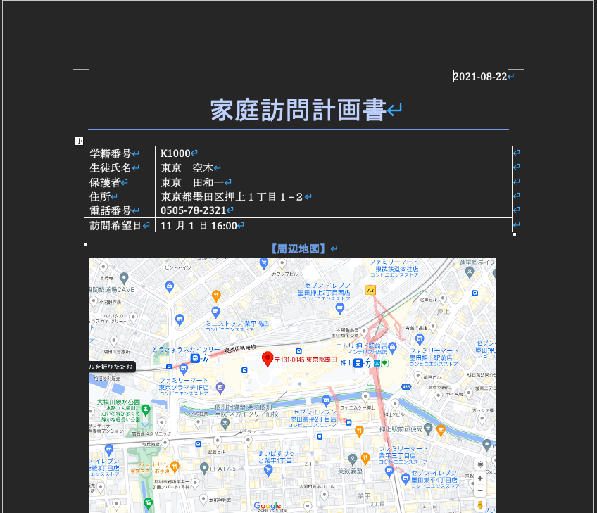

# 家庭訪問RPA

# 作成した目的
- RPAに興味があった
- seleniumをインターンで使うからその練習

# 利用される場面
- Excel上生徒の情報があるとする．家庭訪問を行うとなった時に家がどこにあるか探す必要がある．しかし、住所をGoogleMapで検索して周辺地図を取得
などといった作業には時間かかる．先生はただでさえ忙しいのに、それをWordなどでまとめようとすると莫大な時間がかかってしまう．それを解決するのがこの
RPAである．

# seleniumとは
- Web ブラウザの操作を自動化するためのフレームワーク
- 2004 年に ThoughtWorks 社によって Web アプリケーションの UI テストを自動化する目的で開発

# ライブラリのインストール
~~~
# seleniumのインストール
pip install selenium
# xlwingsのインストール(Excel操作ライブラリ)
pip install xlwings
# python-docxのインストール(Word操作ライブラリ)
pip install python-docx
# Pillowのインストール(画像加工ライブラリ)
pip install pillow
~~~

# webドライバのインストール(今回はchromeを使う)
~~~
brew cask install chromedriver
~~~

# 一連の流れ
- Excelシートを用意 

- 実行
~~~
python go-home.py
~~~
- 結果 
wordディレクトリに家庭訪問計画書が作成される．存在しない住所の場合はエラーとなる．
Excelシートの結果にも記入がされる．成功ならOK失敗ならerror
- 作成例

